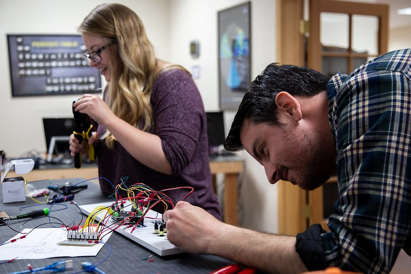

---
# Feel free to add content and custom Front Matter to this file.
# To modify the layout, see https://jekyllrb.com/docs/themes/#overriding-theme-defaults

layout: default
title: Home
---
<!-- 
## <a href="./pro-works/index.html">View Professional Works</a>
## <a href="./resume/index.html">View Resume</a> -->



Hello! My name is Ally Goodman-Janow and I am a Senior Software Developer and Manager.

### A little bit about me

For the past 7+ years, I have worked at a technology company in Corrales, NM, as the Managing Senior Developer. 

My job included tasks such as: 
* Programming touch table & desktop applications
* Researching & learning new technologies / languages
* Managing a team of 7-8 software developers
* Managing project allocations
* HR duties (onboarding, offboarding, training)
* Scheduling meetings
* Quality Assurance testing and bug reporting
* Creating processes for success

<b>Unity and C#</b> are my main programming tools, but I have used many other languages, such as Java, C, C++, Javascript, and many more.

I have utilized web languages, such as HTML, CSS, Vue.js, Node.js, Directus, etc., and have experience using databases such as MySQL, SQLite, and PostgreSQL. 

I have also played with kinects, arduinos, and microcontrollers.

Soft skills include: organization, professional communications (written and verbal), creative thinking, & problem solving.

### Companies for whom I've made applications

* Facebook (before they were Meta)
* Smithsonian (National Museum of African Art & National Air and Space Museum)
* World War II Museum
* San Diego Zoo
* California Science Center
* Da Vinci Science Center
* Space Needle
* Verizon
* Colonial Williamsburg 
* Collins Aerospace
* X-Prize / Qualcomm

And many more...

### Education

I have a Bachelors of Science from the Univertsity of New Mexico with a focus in Computer Science, and a minor in Interdisciplinary Film and Digital Media.

I graduated in 2018 with a cumulative GPA of 3.8 and with honors.

